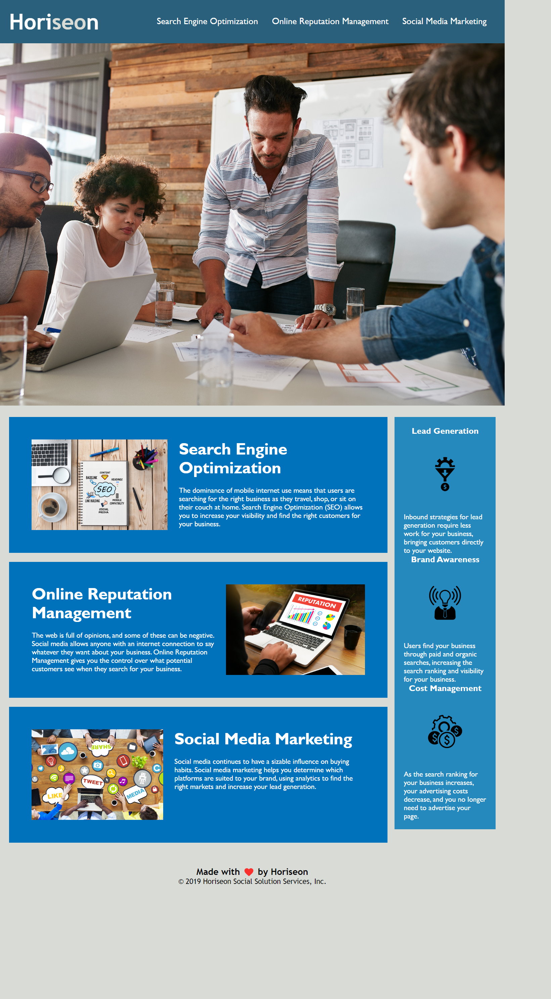

# <Horiseon Web-dev cheatsheet>

## Description

I have cleaned up this pages CSS by consolidating styling into classes and reoving duplicate lines. I aimed to make the webpage more accessible by adding alt text to the images and icons to allow for text to speech software.

## Installation

Not Required. 

## Usage

Access via browser at: https://lhoole.github.io/Web-development-infographic-refactor/ to view.

To provide advice on web design concepts

## License

See LICENSE

